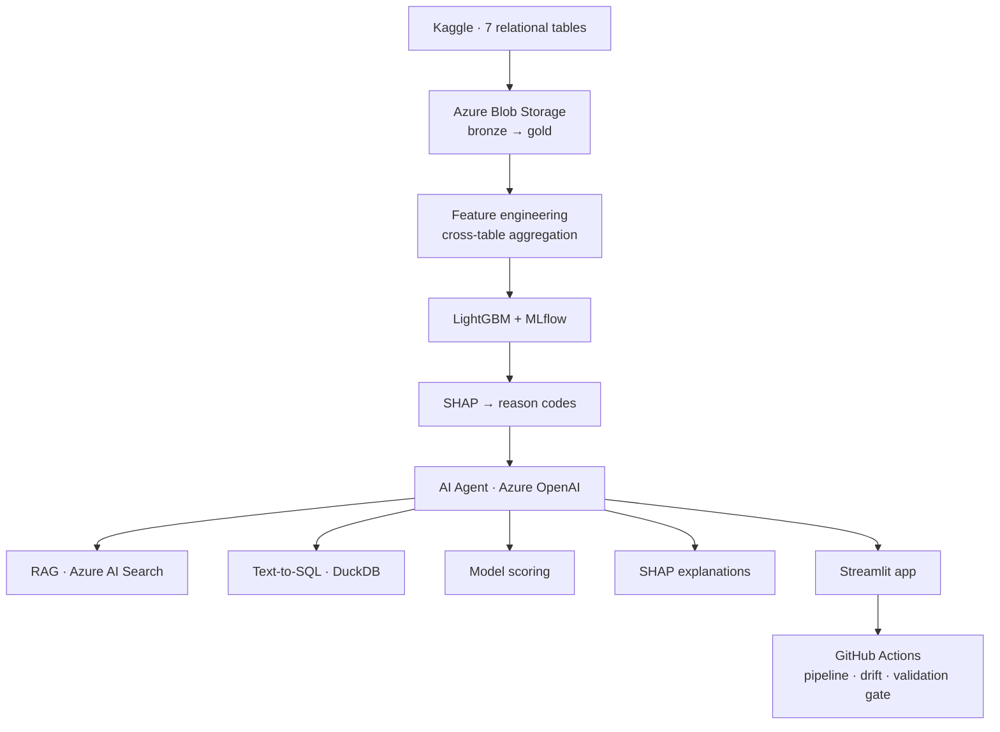
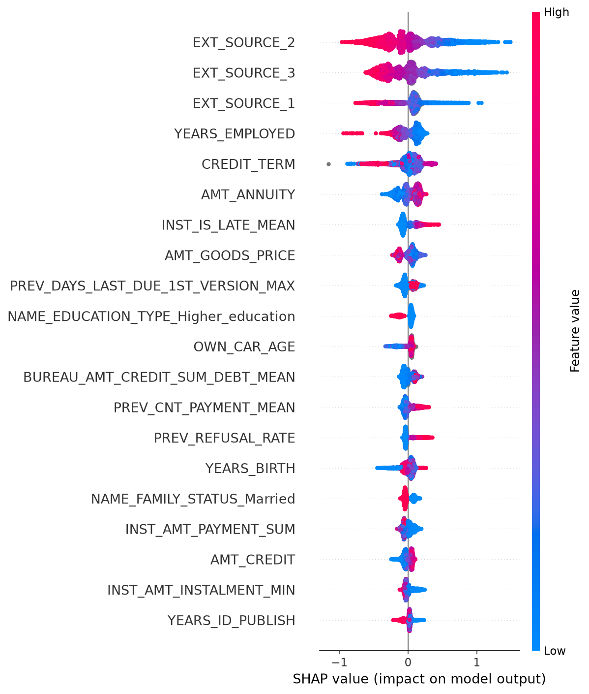
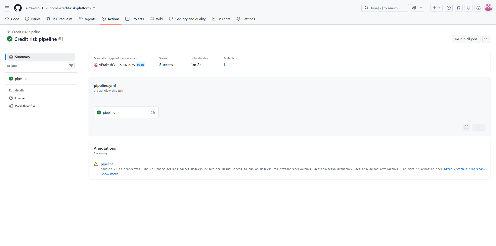
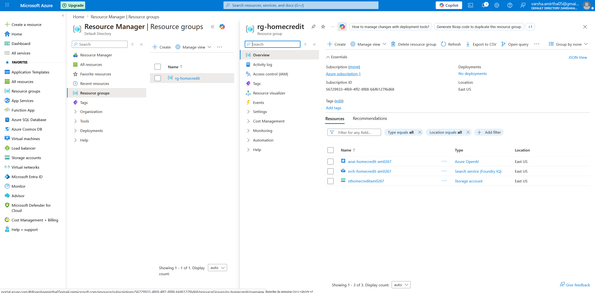

# Credit Risk Decisioning Platform

An end-to-end credit risk system: automated data pipeline on Azure, a validated
default-prediction model, regulatory-grade explainability, and a tool-using AI agent
that produces governed lending recommendations.

**[▶ Live demo](https://home-credit-risk-platform-4cvrlfwqhv7katdi54rgkf.streamlit.app/)** · Built on the Home Credit Default Risk dataset
(307,511 applications across 7 relational tables)


---

## What this is

Most credit-risk portfolio projects train a classifier and stop. This one is built as a
system a lending institution could actually operate:

- **Data engineering** — 7 relational tables aggregated into a single modelling table on Azure
- **Modelling** — LightGBM at **0.786 ROC-AUC** (5-fold stratified CV, ±0.007)
- **Explainability** — SHAP drivers mapped to adverse-action reason codes, as fair lending requires
- **Agentic AI** — an LLM agent orchestrating four tools to produce recommendations, not decisions
- **Automation** — a scheduled pipeline with drift monitoring and a model-quality gate
- **Governance** — protected characteristics excluded, human-in-the-loop by design

---

## Architecture



## The agent

The centrepiece is not a chatbot. Given a question, the agent **plans**, selects tools,
executes them, and synthesises a grounded answer.

Asked *"Assess applicant X and give me a recommendation"*, it scores the applicant,
retrieves the applicable policy band, extracts SHAP drivers, and returns a recommendation
citing both the factors and the policy — explicitly flagged as requiring human review.

Retrieval (RAG) is one tool inside the agentic loop rather than a separate feature. The
knowledge base holds a data dictionary, an illustrative credit policy, and adverse-action
reason codes.

**Guardrails:** SQL restricted to read-only `SELECT`; no autonomous decisions; model
internals never surfaced in applicant-facing language; session and daily rate limits on
the public demo.


---

## Model

| | |
|---|---|
| Algorithm | LightGBM (binary, class-imbalance handling) |
| Validation | 5-fold stratified cross-validation |
| **ROC-AUC** | **0.786** (out-of-fold), ±0.007 across folds |
| Class balance | 8.07% default rate |
| Features | ~700 engineered from 7 tables |

AUC rather than accuracy: at an 8% default rate, predicting "nobody defaults" scores 92%
accuracy and is worthless. For reference, the winning Kaggle ensembles on this dataset
reached roughly 0.80 — 0.786 is a realistic production-grade result, not an inflated one.

**Strongest predictors:** external bureau scores, `INST_IS_LATE_MEAN` (proportion of past
instalments paid late), and `CREDIT_TERM`. The latter two are engineered features — past
payment behaviour predicts future payment behaviour better than anything on an application form.



---

## Fairness and governance

**Gender was excluded** from the feature set per credit policy. The exclusion cost
**0.001 AUC** (0.787 → 0.786), indicating the model derives its signal from payment
behaviour and bureau data rather than protected characteristics.

**Age was retained.** It ranks 24th by mean absolute SHAP contribution — moderate, not
dominant. Unlike gender, age has an actuarially demonstrable relationship to default risk
and is conditionally permitted under most fair lending frameworks where such justification
exists.

**Human-in-the-loop by design.** The system produces recommendations; a human underwriter
records the decision. No application is declined by automated process alone.

### Known limitations

Stated deliberately — these are what a production deployment would need to address:

- **Proxy discrimination not tested.** Removing gender does not remove correlated proxies.
  Production would require fairness metrics (demographic parity, equalised odds) and model
  risk sign-off.
- **Selection bias.** The observed 8.07% default rate reflects *approved* applicants only.
  Rejected applicants are unobserved, so the model inherits the lender's historical approval
  policy — the reject inference problem.
- **The credit policy is synthetic**, modelled on standard consumer lending practice.
- **Rate limiting is best-effort**, using session state. Production would need server-side
  identity and external state.
- **RAG uses keyword search**, not vector embeddings — adequate for a small, well-structured
  corpus.

---

## Automation

A GitHub Actions workflow runs weekly (and on demand):

1. Fetches the feature table from Azure Blob
2. **Drift monitoring** — Population Stability Index across the top 10 features, alerting above 0.25 (the conventional credit-risk threshold)
3. **Validation gate** — recomputes AUC and **fails the pipeline** if performance drops below 0.75
4. Publishes both reports as artifacts

A pipeline that silently ships a degraded model is worse than no pipeline.



---

## Azure infrastructure

| Service | Role |
|---|---|
| Blob Storage (ADLS Gen2) | Data lake — bronze and gold layers |
| AI Search | Vector-free RAG index over the knowledge base |
| Azure OpenAI (`gpt-5-mini`) | Agent reasoning and tool orchestration |
| GitHub Actions | Orchestration (free tier, indefinite) |



**A note on hosting.** The application runs on Streamlit Community Cloud rather than Azure
App Service — a deliberate cost decision, keeping the demo permanently free while the data
and AI infrastructure remain on Azure. Azure resources were provisioned during the free
trial; screenshots document the deployed system.

The public demo runs on a **stratified 5,000-applicant sample** (preserving the default
rate) so it loads quickly and requires no cloud dependency. The pipeline processes all
307,511 records.

---

## Stack

Python · LightGBM · SHAP · MLflow · DuckDB · Polars/pandas · Streamlit · Azure Blob Storage ·
Azure AI Search · Azure OpenAI · GitHub Actions

## Running locally

```bash
git clone https://github.com/APrakash31/home-credit-risk-platform.git
cd home-credit-risk-platform
python -m venv .venv && source .venv/bin/activate
pip install -r requirements.txt
cp .env.example .env          # add your Azure credentials

python src/ingest/download_data.py
python src/features/build_features.py
python src/models/train.py
python src/explain/shap_analysis.py
streamlit run app/streamlit_app.py
```

## Repository
src/ingest/      Kaggle download, Azure Blob upload
src/features/    Cross-table aggregation and feature engineering
src/models/      Training with cross-validation and MLflow
src/explain/     SHAP analysis and reason code mapping
src/agent/       RAG retrieval, tools, agent loop
src/monitoring/  PSI drift detection
src/pipeline/    Automation support scripts
knowledge_base/  Data dictionary, credit policy, reason codes
app/             Streamlit application